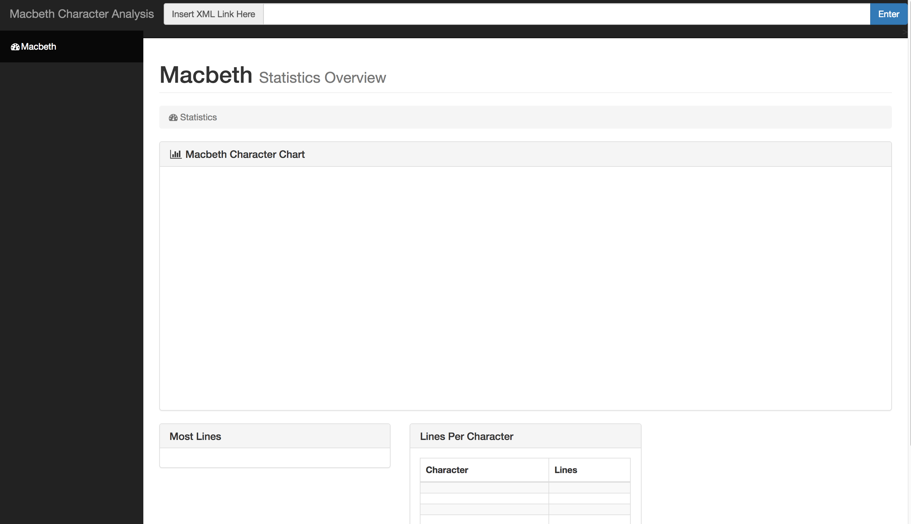

# Shakespeare Browser Analysis

### To run project

1. Download Zip
2. Type npm install
3. Go localhost:8080
4. Type in the url 'http://www.ibiblio.org/xml/examples/shakespeare/macbeth.xml'
5. Enjoy!
